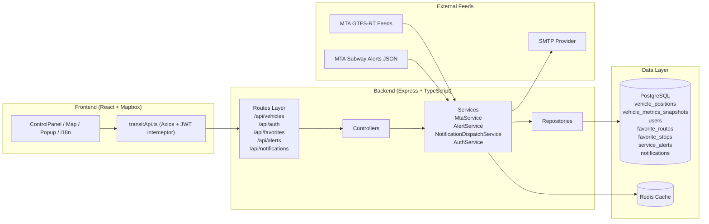

# Architecture Diagram

This document describes the current runtime architecture of the platform.

## System Architecture (Mermaid)

## Runtime Flows

### 1) Vehicle ingestion (every 10s)
1. `MtaService.fetchAndSaveAllFeeds()` pulls GTFS realtime feeds.
2. Parse `vehicle` entities when GPS exists.
3. Fallback: parse `tripUpdate` and map `stop_id -> lat/lon` from stop data.
4. Persist/upsert into `vehicle_positions`.
5. Write per-route metric snapshots into `vehicle_metrics_snapshots`.
6. Frontend reads from `GET /api/vehicles`.

### 1.1) Time-window analytics flow
1. Frontend requests `GET /api/vehicles/insights` with `route/range/compare`.
2. Backend queries `vehicle_metrics_snapshots` for current window series.
3. Backend computes current average, previous-window average, delta, and top routes.
4. UI renders sparkline + comparison badge + route ranking bars.

### 2) Alert ingestion (every 60s)
1. `AlertService.fetchAndSaveAlerts()` pulls MTA alerts JSON.
2. Normalize route/stop/entity fields.
3. Upsert alerts to `service_alerts`.
4. Match with user favorites and create `notifications`.
5. Dispatch email via SMTP (if enabled/configured).

### 3) User personalization flow
1. User logs in via `/api/auth/login` and receives JWT.
2. Frontend stores JWT and sends `Authorization: Bearer ...`.
3. User manages favorite routes/stops via `/api/favorites/*`.
4. Notification center reads `/api/notifications`.

## Design Choices

- **Fallback over failure**: if vehicle GPS is missing, infer by `tripUpdate + stop_id`.
- **Layered backend**: routes -> controllers -> services -> repositories.
- **Data separation**: operational data in PostgreSQL, hot access in Redis.
- **Feed compatibility**: alerts consume JSON feed that does not require API key.

## Current Improvement Opportunities

- Add OpenAPI/Swagger documentation for all endpoints.
- Add automated tests (auth, favorites, notifications, fallback parsing).
- Add structured logging and request tracing IDs.
- Add CI pipeline (lint + test + build).

